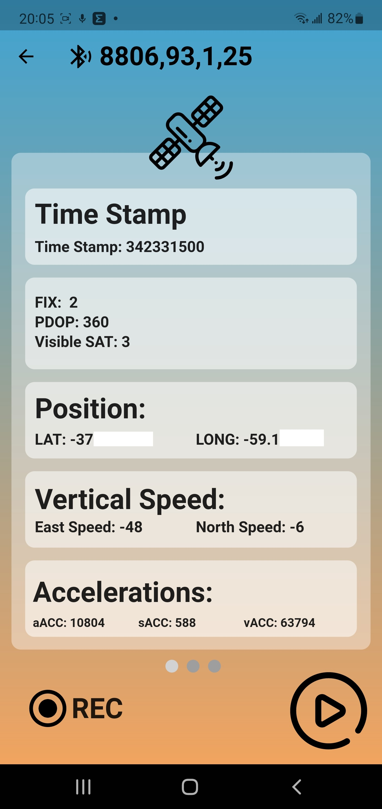

# Wise4Sport

Wise4Sport test sensor and features. Connection through UART over BLE. 

## Getting Started

**Packages used:**
- flutter_svg: [link](https://pub.dev/packages/flutter_svg)
- flutter_blue: ^0.8.0 [link](https://pub.dev/packages/flutter_blue)
- signal_strength_indicator: ^0.4.0 [link](https://pub.dev/packages/signal_strength_indicator)
- smooth_page_indicator: ^0.3.0-nullsafety.0 [link](https://pub.dev/packages/smooth_page_indicator)

## UART Over BLE & Battery Services
```C
sprintf(BLETx, "%0.2f, %0.2f, %0.2f\n", pitch, roll, yaw);

#define SERVICE_UUID                  "6E400001-B5A3-F393-E0A9-E50E24DCCA9E"
#define CHARACTERISTIC_UUID_RX        "6E400002-B5A3-F393-E0A9-E50E24DCCA9E"
#define CHARACTERISTIC_UUID_TX        "6E400003-B5A3-F393-E0A9-E50E24DCCA9E"
#define SERVICE_UUID_BATTERY          BLEUUID((uint16_t)0x180F)
#define CHARACTERISTIC_UUID_BATTERY   BLEUUID((uint16_t)0x2A19)
```
## GIF
<p align="center">

</p>

## Screenshots
<p align="center">




</p>